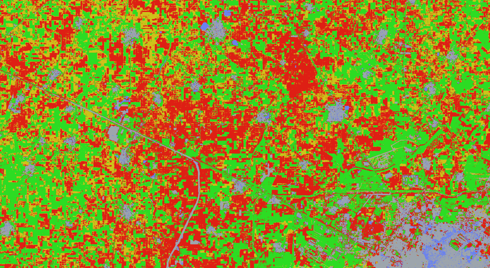

# Detecting Fires at plot-level in Haryana and Punjab

An open source python code to detect plot-level burn in India using Planet Labs Imagery.

Final version of workflow is presented in NewCode/Final_Workflow_v2.ipynb

## Unclassified Image at end of season

## Classified Image 

(red indicates burned residue)
